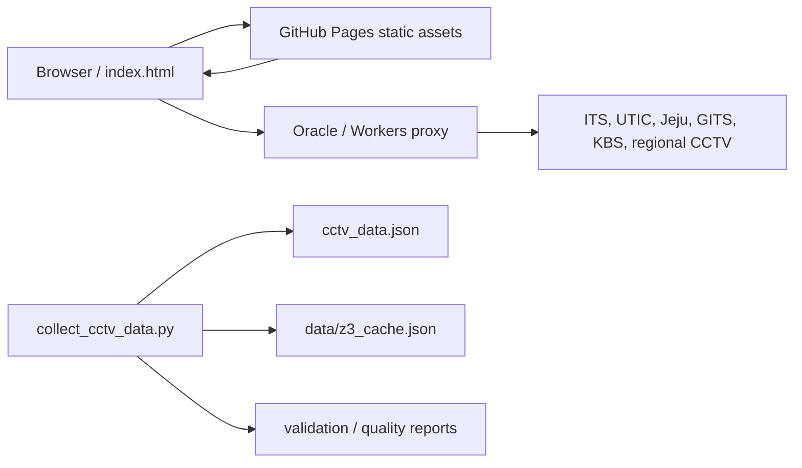

# CCTV Viewer

전국 CCTV를 수집, 정규화, 검증해서 정적 프론트엔드와 동적 프록시로 재생하는 프로젝트입니다.

## 아키텍처



## 핵심 구조

- `index.html`, `css/style.css`, `js/app.js`가 메인 프론트엔드입니다.
- `js/world-tour.js`는 World Tour 진입 시에만 동적으로 로드됩니다. 대형 목록은 카드 120개, 검색 결과 200개, 지도 마커 600개로 렌더링을 제한합니다.
- `js/runtime-config.js`가 빌드 버전, 프록시 기본값, 품질 엔드포인트를 한 곳에서 정의합니다.
- `server/app.py`는 프록시, Z3 캐시, Jeju/KBS/UTIC 같은 특수 엔드포인트를 제공합니다.
- `collect_cctv_data.py`는 `collectors/pipeline.py`의 공통 병합/정렬 규칙을 사용해 ITS/UTIC 및 지역별 collector를 합쳐 최종 `cctv_data.json`을 생성합니다.
- `collectors/`에는 지역별 수집기가 들어 있습니다.
- `scripts/`에는 감사, 복구, 검증, 보정용 운영 스크립트가 있습니다.
- `scripts/adaptive_collection.py`는 소스별 변동률과 실패율을 학습해 수집 주기를 자동 조절합니다.
- `scripts/browser_canary.mjs`는 실제 Chromium으로 앱 초기 재생을 점검하는 수동 스모크 테스트입니다.

## 로컬 실행

1. 환경변수를 준비합니다.
2. `python collect_cctv_data.py`로 데이터를 갱신합니다.
3. `python server/app.py`로 프록시 서버를 실행합니다.
4. 정적 파일은 로컬 웹서버로 서빙합니다.

```bash
python collect_cctv_data.py
python server/app.py
```

브라우저 스모크 테스트를 하려면:

```bash
npm install
npm run browser:canary
```

로컬 서버를 붙여서 확인하려면 `CCTV_APP_BASE=http://127.0.0.1:8000/`를 함께 지정하면 됩니다.

## 환경변수

- `ITS_API_KEY`: ITS OpenAPI 키
- `UTIC_API_KEY` or `UTIC_KEY`: UTIC/OpenData key
- `CCTV_PUBLIC_PROXY_BASE`: 공개 프록시 베이스 URL
- `CCTV_WORKER_PROXY_BASE`: Worker 프록시 베이스 URL
- `CCTV_PROXY_BASES`: 프론트에서 순환할 프록시 후보 목록
- `HLS_DIR`: FFmpeg HLS 세그먼트 디렉터리
- `CCTV_ROOT_DIR`: 서버가 상태·데이터 파일을 찾는 프로젝트 루트
- `IDLE_TIMEOUT`: 유휴 스트림 종료 시간
- `MAX_STREAMS`: 동시에 유지할 FFmpeg 프로세스 수
- `STREAM_START_TIMEOUT`: HLS 첫 playlist 대기 시간(초)
- `MAX_PROXY_RESPONSE_BYTES`: 공개 프록시가 메모리에 읽는 최대 응답 크기
- `RATE_LIMIT_WINDOW_SECONDS`: 동적 upstream 요청 제한 윈도우
- `RATE_LIMIT_MAX_REQUESTS`: IP·엔드포인트별 윈도우당 최대 요청 수
- `Z3_LOCAL_CACHE_FILE`: 로컬 Z3 캐시 경로
- `JEJU_ID_MAP_PATH`: 제주 short-id 매핑 파일
- `CCTV_DISABLE_STARTUP_JOBS`: 테스트 시 백그라운드 잡 비활성화

## 운영 상태 엔드포인트

- `/health`: 프로세스 생존 여부와 활성 FFmpeg 스트림 수
- `/health-status`: CCTV 상태 스냅샷. 파일이 쓰기 중 손상되면 마지막 정상 스냅샷을 제공하고, 정상값이 없으면 `UNKNOWN`으로 응답
- `/canary-status`: 카나리 점검 결과
- `/ops-status`: 운영 상태 요약

## 검증

```bash
python -m unittest test_validate_cctv_data.py test_operations_quality_fixes.py test_gits_collector.py
python validate_cctv_data.py
npm run browser:canary
```

`scripts/validate_static_data.py`는 저장된 CCTV JSON의 유효성과 UTIC key 재유입을 검사합니다. 동일한 검사는 push/PR의 `Quality Gate` workflow에서도 실행됩니다.

### 적응형 수집 주기

GITS, UTIC URL 갱신, 전체 카탈로그 수집은 고정 주기로 무조건 실행하지 않습니다. workflow는 6~12시간 간격으로 깨어나고, `data/collection_schedule.json`의 마지막 성공 시각, URL/메타데이터 변경률, 소스 실패율, 연속 실패 횟수를 사용해 실제 실행 여부와 다음 주기를 결정합니다. 안정적인 소스는 주기를 늘리고, 토큰 변동이나 실패가 늘어난 소스는 최소 주기까지 단축합니다.

```bash
python scripts/adaptive_collection.py plan
python scripts/adaptive_collection.py record --task gits_ingest --result success
```

## 새 collector 추가

1. `collectors/`에 새 collector 클래스를 추가합니다.
2. 반환 schema는 최소한 `id`, `name`, `lat`, `lng`, `url`, `source`, `status`를 맞춥니다.
3. `collect_cctv_data.py`의 collector 목록에 추가합니다.
4. 가능하면 `original_id`를 포함해 병합 안정성을 높입니다.

## 메모

- Kakao Maps appkey는 공개 키지만 도메인 제한을 걸어두는 것이 좋습니다.
- `/stream`은 HTTP/HTTPS/RTSP/RTSPS만 허용하며, 사설망·loopback·link-local 주소로의 FFmpeg 연결을 차단합니다.
- `/proxy` 응답은 기본 16 MiB를 넘으면 중단해 비정상 대용량 응답으로 인한 메모리 고갈을 줄입니다.
- 프록시 오류 로그와 응답은 upstream query의 API key/token을 노출하지 않습니다.
- 동적 provider 오류도 내부 예외 문자열을 외부 응답에 포함하지 않습니다.
- 정적 UTIC URL에는 API key를 저장하지 않고, 서버 프록시가 환경변수의 키를 upstream 요청에만 주입합니다.
- Deep Inspection도 동일하게 검사 요청에만 키를 주입하고 결과 URL에는 저장하지 않습니다.
- `/proxy`와 동적 provider 엔드포인트는 IP·경로별 rate limit을 적용하며, `/hls`와 정적 파일은 재생을 위해 제외합니다.
- 서버 시작 시 오래된 FFmpeg HLS 고아 디렉터리를 정리하고, playlist/segment는 임시 파일로 작성합니다.
- Pages용 CCTV 데이터 분할도 원자적으로 저장하며, 원본 데이터가 없거나 배열이 아니면 배포를 중단합니다.
- FFmpeg가 외부 원인으로 먼저 종료되어도 cleanup loop가 다음 주기에 슬롯과 HLS 파일을 회수합니다.
- SSH 개인키, `.env`, API 비밀값은 저장소에 커밋하지 않습니다. 이미 Git 이력에 포함된 키는 추적 제외만으로 안전해지지 않으므로 반드시 폐기하고 재발급해야 합니다.
- `verify=False`는 일부 공공 API 인증서 문제 대응용이지만, 가능하면 점진적으로 줄이는 편이 좋습니다.
- `CCTV_DISABLE_STARTUP_JOBS=1`은 테스트나 정적 분석 시 유용합니다.
